这是一个基于Android平台开发的基础案例集。旨在用于给初学者快速了解Android平台的开发。

开发工具和平台

- Android Studio 2.0以上
- java语言
- android sdk
- gradle 2.0以上
- git
- github

## 问答

#### 案例集面向谁？

主要是面对高校以及一些对Android开发零基础的人群。<br/>

## 目录
1. LayoutDemo 关于android中布局相关案例集，包括：线性布局，表格布局，相对布局，绝对布局以及Frame布局
2. ComponentUI 关于android中核心控件以及控件事件处理的相关案例集。

## 开发者

- zzxb


## 版本

V 1.0.0

## 核心知识点

#### 学习前准备

1.[下载android studio IDE](http://www.android-studio.org/index.php/download/androidstudio-download-baidudisk/)<br>
2.熟悉最基本的面向对象语言开发JAVA<br/>
3.学习android开发的知识体系，如下图<br>
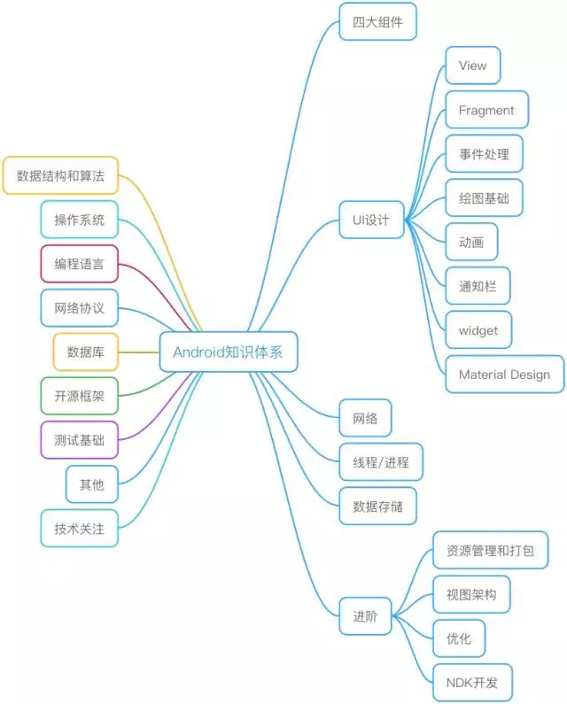

#### android studio 开发工具的安装

参考[安装与配置](http://stormzhang.com/devtools/2014/11/25/android-studio-tutorial1/)

#### 关于Gradle知识的了解

在首次安装Android Studio或首次创建Android工程时，会自动下载一个软件，你会发现很慢，甚至你会认为软件处于假死状态，请注意，不要强制关闭软件，因为这样会导致日后工程不能使用等问题。那么，到底是自动下载什么呢？为什么这么慢呢？

1.首先自动下载的是一个自动化构建的工具，它叫Gradle,与[Maven](https://github.com/zzxb/tec-docs/blob/master/Maven_install.md)是一样的功能。

2.下载慢是因为Gradle这个软件在Google端，需要科学上网才能提高或者顺利下载。建议大家，在学习android的时候一定要学会科学上网方式。

那么，到底什么是Gradle？

Gradle是一种依赖管理工具，基于Groovy语言，面向Java应用为主，它抛弃了基于XML的各种繁琐配置，取而代之的是一种基于Groovy的内部领域特定（DSL）语言。

Android Studio除了要下载Gradle，还需要下载一个插件[gradle-plugin](https://developer.android.com/studio/releases/gradle-plugin.html),它是后期在Android Studio编译打包代码最重要的插件.

###### 注意：初学者首次使用Android Studio时，很多不能正常运行的工程大部分都是由于Gradle和Gradle-plugin下载不完整导致。

#### Android Studio的使用

1.首页介绍，如下图：


2.新建工程，已在安装Android Studio中介绍了。

3.打开已存在的工程。如下图：


4.进入主界面，各Bar介绍

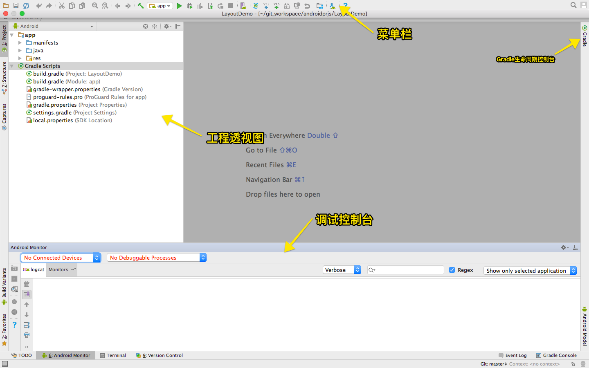

5.菜单栏，如下图：


6.工程项目透视图有多种，常用两种，如下图：

 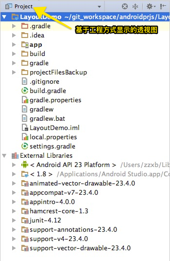

7.代码编辑区，如下图：


8.用于观察后台日志或监控程序执行过程以及性能的监控控制台，如下图：


9.对Gradle自动构建手动的操作，使用Gradle生命周期控制台，如下图:


######  以上就是对于Android Studio IDE界面的介绍，下面我们来看看，基于Android Studio的目录结构。

首先，Android Studio中没有像Eclipse或MyEclipse中WorkSpace(工作空间)的概念，只有工程或项目的概念，在Android Studio中的工程包含多个Moudle(模块).每个模块都可以独立运行或被引用。Android Studio强烈建议一个工程或项目多Moudle(模块)的设计，这样更加的便于维护和开发。

那么，我们来看一下目录结构，以及它们的作用。

1.我们再来回顾一下Android工程透视图,如下图：


app模块是我们关注的重点

2.mainifests目录下mainifest.xml，如下图:


该文件是每个android程序中必须的文件。它位于整个项目的根目录，描述了package中暴露的组件（activities, services, 等等），他们各自的实现类，各种能被处理的数据和启动位置。 除了能声明程序中的Activities, ContentProviders, Services, 和Intent Receivers,还能指定permissions和instrumentation（安全控制和测试），同时用于控制Android应用的名称、图标、访问权限等整体属性。

3.java目录是源代码目录，如下图:

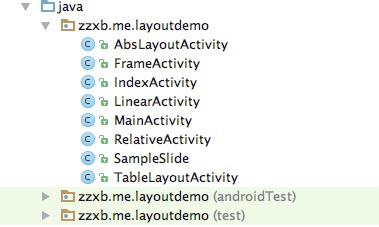

4.res目录是所有android模块下所有资源文件的集合，比如：layout布局xml配置文件，图片资源文件集合，资源信息或国际化配置信息文件。


那么，我们逐个看一下各个子目录作用以及文件。

###### drawable目录，将图片等资源放在drawable-hdip中，将一些和XML文件相关的内容（图片选择器、文字颜色选择器、自定义形状等）放在drawable中。


###### layout目录，放置所有界面的布局xml文件。

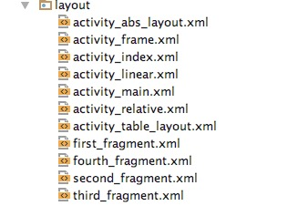

###### 具体布局样例，如图：

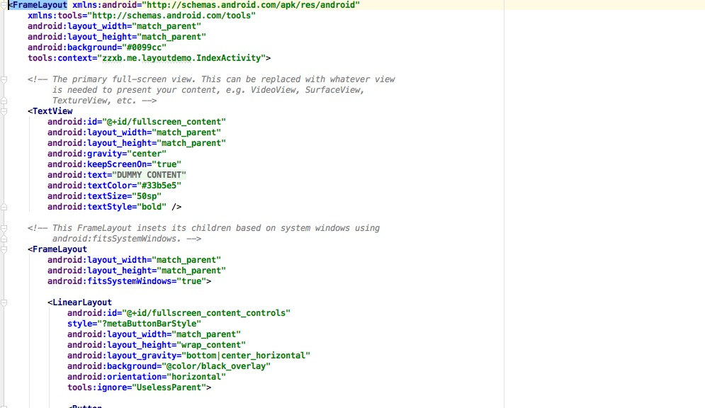

###### mipmap目录，用于存放原生图片（图ic_launcher.png），缩放上有性能优化; 

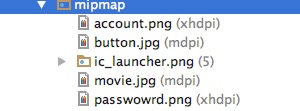

###### values目录，讲所有字符串资源文件，颜色等资源文件


###### strings.xml 字符串资源文件


###### colors.xml 颜色资源文件


###### dimens.xml 颜色资源文件

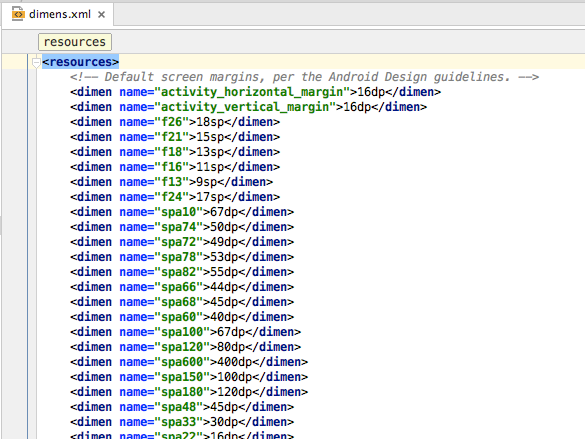

5.Gradle Script目录，关于所有Gradle的配置文件。

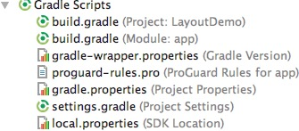

###### build.gradle(project)

设置整个工程的gradle配置文件

###### build.gradle(Module)

设置工程中某个模块的gradle配置文件，这个文件是我们关注的重点，尤其是当我们引入第三方类库时，要在这个文件中配置。如下图：

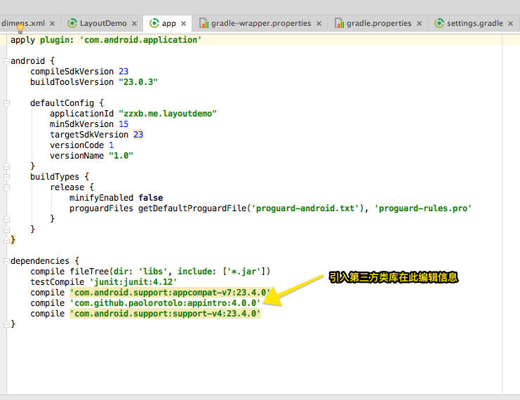

###### gradle-wrapper.properties

配置gradle的基本信息，例如：安装目录等信息。一般，我们很少修改。

###### gradle.properties

配置gradle编译运行以及性能的配置文件

###### local.properties

配置android sdk目录位置

#### 关于android运行

对于android程序运行，目前有两种方式：虚拟机和真机运行

虚拟机，这种方式可以在android studio中配置，也可以直接使用第三方虚拟机，比如：[genymotion](https://www.genymotion.com/)和[海马玩](http://droid4x.haimawan.com/)等.介于genymotion访问速度非常慢的原因，大家也可以使用海马玩。第三方虚拟机的方式不需要配置安装直接运行，android studio会以真机运行方式执行安装和运行。

真机运行，这种方式用USB线连接电脑的方式直接安装运行。

##### 我建议使用这种方式，因为真机运行可以更准确的测试程序兼容性、性能等情况。

###### 推荐一个基于chrome的第三方插件-Vysor,这是一个可以将真机屏幕投射到电脑上的插件，可以用于演示项目。

#### 1. LayoutDemo之android布局

##### 有哪些布局类型？

Android系统中为我们提供的五大布局：LinearLayout(线性布局)、FrameLayout(单帧布局)、AbsoluteLayout(绝对布局)、TablelLayout(表格布局)、RelativeLayout(相对布局)。其中最常用的的是LinearLayout、TablelLayout和RelativeLayout。这些布局都可以嵌套使用。<br/>

##### LinearLayout(线性布局)

线性布局是按照水平或垂直的顺序将子元素(可以是控件或布局)依次按照顺序排列，每一个元素都位于前面一个元素之后。线性布局分为两种：水平方向和垂直方向的布局。分别通过属性android:orientation="vertical" 和 android:orientation="horizontal"来设置。<br/>

案例代码分析：

```xml
<LinearLayout xmlns:android="http://schemas.android.com/apk/res/android"
    xmlns:tools="http://schemas.android.com/tools"
    android:layout_width="match_parent"
    android:layout_height="match_parent"
    android:orientation="vertical"
    android:gravity="center_vertical|center_horizontal"
    tools:context="zzxb.me.layoutdemo.MainActivity">

    <Button
        android:id="@+id/linearLO"
        android:text="@string/linear_name"
        android:layout_weight="1"
        android:layout_width="wrap_content"
        android:layout_height="wrap_content" />

    <TextView
        android:layout_weight="4"
        android:layout_width="wrap_content"
        android:layout_height="wrap_content" />

    <Button
        android:id="@+id/tableLO"
        android:text="@string/table_name"
        android:layout_weight="1"
        android:layout_width="wrap_content"
        android:layout_height="wrap_content" />

    <TextView
        android:layout_weight="4"
        android:layout_width="wrap_content"
        android:layout_height="wrap_content" />


    <Button
        android:id="@+id/frameLO"
        android:text="@string/frame_name"
        android:layout_weight="1"
        android:layout_width="wrap_content"
        android:layout_height="wrap_content" />

    <TextView
        android:layout_weight="4"
        android:layout_width="wrap_content"
        android:layout_height="wrap_content" />


    <Button
        android:id="@+id/relativeLO"
        android:text="@string/relative_name"
        android:layout_weight="1"
        android:layout_width="wrap_content"
        android:layout_height="wrap_content" />

    <TextView
        android:layout_weight="4"
        android:layout_width="wrap_content"
        android:layout_height="wrap_content" />


    <Button
        android:id="@+id/absLO"
        android:text="@string/abslayout_name"
        android:layout_weight="1"
        android:layout_width="wrap_content"
        android:layout_height="wrap_content" />

</LinearLayout>
```

线性布局是用\<LinearLayout\>标签标示，其中常用的属性：<br/>
layout_width/layout_height:设置宽度和高度，其值有：wrap_content(适配内容大小)，match_parent(适配父容器大小),此两个属性在各个控件中为通用属性<br/>
id:唯一标识该控件值<br/>
orientation:设置该布局是水平布局(horizontal)还是纵向布局(vertical)<br/>
gravity:设置控件的对齐方式，常用值：center_vertical(纵向居中)|center_horizontal(水平居中)<br/>

在\<Button\>标签中，也同样有id,layout_width以及lay_height属性。同时，还有如下常用属性：<br>
text:设置按钮文字，这里有两种方式，一种是直接硬编码，即直接写内容，例如：<br>

```xml
   android:text="按钮"
```

第二种方式是非硬编码方式，是通过配置strings.xml文件来配置，例如：<br/>

```xml
<resources>
   <string name="btnText">按钮</string>
</resources>
```

然后，通过：<br/>

```xml
android:text="@string/btnText"
```

引用。<br/>

页面跳转的方式：<br/>

```java
                Intent intent = new Intent();
                intent.setClass(MainActivity.this,LinearActivity.class);
                startActivity(intent);
```

##### TableLayout(表格布局)

表格布局与常见的表格类似，以行、列的形式来管理放入其中的UI组件。表格布局使用\<TableLayout\>标签定义，在表格布局中，可以添加多个\<TableRow\>标签占用一行。由于\<TableRow\>标签也是容器，所以还可以在该标签中添加其他组件，每添加一个组件，表格就会增加一列。在表格布局中，列可以被隐藏，也可以被设置为伸展的，从而填充可利用的屏幕空间，还可以设置为强制收缩，直到表格匹配屏幕大小。<br/>

TableLayout跟TableRow 是一组搭配应用的布局，TableLayout置底，TableRow在TableLayout的上方，而Button、TextView等控件就在TableRow之上.TableLayout是一个应用错杂的布局，最简单的用法就仅仅是拖沓控件做出个界面，但实际上，会经常在代码里应用TableLayout，例如做出表格的结果。<br/>

重要的几个属性如下:<br/>

```xml
    android:collapseColumns="1,3" 隐藏第二列和第4列的按钮
    android:stretchColumns="0,2,4" 第一列和三列以及第五列的空白textview被拉伸
    android:shrinkColumns="1,3"  第二列和第4列的按钮被收缩
```

案例代码：

```xml
    <TableLayout
        android:stretchColumns="0,2,4"
        android:layout_width="match_parent"
        android:layout_height="match_parent">
        <EditText
            android:hint="请输入用户名"
            android:textSize="15sp"
            android:layout_margin="6dp"
            android:background="@drawable/corner_round"
            android:drawableLeft="@mipmap/account"
            android:layout_width="match_parent"
            android:layout_height="wrap_content" />

        <EditText
            android:hint="请输入密码"
            android:layout_margin="6dp"
            android:textSize="15sp"
            android:inputType="textPassword"
            android:background="@drawable/corner_round"
            android:drawableLeft="@mipmap/passwowrd"
            android:layout_width="match_parent"
            android:layout_height="wrap_content" />

        <TableRow>
            <TextView
                android:layout_width="wrap_content"
                android:layout_height="wrap_content" />

            <Button
                android:text="登录"
                android:layout_width="wrap_content"
                android:layout_height="wrap_content" />

            <TextView
                android:layout_width="wrap_content"
                android:layout_height="wrap_content" />

            <Button
                android:text="注册"
                android:layout_width="wrap_content"
                android:layout_height="wrap_content" />

            <TextView
                android:layout_width="wrap_content"
                android:layout_height="wrap_content" />

        </TableRow>
    </TableLayout>
```

##### FrameLayout(帧布局)

帧布局被设计成在一个屏幕区域显示一个单一的项(single item)。通常FrameLayout显示一个单一的子控件，它支持的布局属性不够丰富，一般通过layout_gravity来设置子控件的位置。<br/>
FrameLayout的子控件被绘制在一个堆栈中，最近添加进来的子控件在堆栈的顶部。<br/>

图例：<br/>

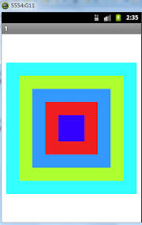

案例代码：<br/>

```xml
    <FrameLayout
        android:layout_width="match_parent"
        android:layout_height="match_parent">

        <ImageView
            android:layout_width="match_parent"
            android:layout_height="match_parent"
            android:src="@mipmap/movie"
            android:contentDescription="@string/movie_desc"
            />
        <ImageView
            android:layout_width="wrap_content"
            android:layout_height="wrap_content"
            android:src="@mipmap/button"
            android:contentDescription="@string/pause_desc"
            android:layout_gravity="center"
            />


    </FrameLayout>
```

##### RelativeLayout(相对布局)

相对布局，子控件的位置关系可以通过子控件与父控件、子控件与子控件来确定，子控件之间位置可以重叠,后面的控件会盖在前面控件之上，拓展性好，灵活方便，是使用最多的布局方式。<br/>

案例代码：<br/>

```xml
    <RelativeLayout
        android:layout_width="match_parent"
        android:layout_height="wrap_content">

        <EditText
            android:id="@+id/et_uname"
            android:hint="请输入用户名"
            android:textSize="20sp"
            android:background="@drawable/corner_round"
            android:layout_alignParentTop="true"
            android:layout_width="match_parent"
            android:layout_height="wrap_content" />

        <EditText
            android:id="@+id/et_pwd"
            android:hint="请输入密码"
            android:inputType="textPassword"
            android:layout_marginTop="12dp"
            android:background="@drawable/corner_round"
            android:textSize="20sp"
            android:layout_below="@+id/et_uname"
            android:layout_width="match_parent"
            android:layout_height="wrap_content" />

    </RelativeLayout>

    <RelativeLayout
        android:layout_width="match_parent"
        android:layout_height="wrap_content">

        <Button
            android:id="@+id/btn_login"
            android:text="登录"
            android:layout_width="150dp"
            android:layout_height="wrap_content" />

        <View
            android:id="@+id/v1"
            android:layout_toRightOf="@+id/btn_login"
            android:layout_width="50dp"
            android:layout_height="0dp" />

        <Button
            android:id="@+id/btn_reg"
            android:layout_toRightOf="@+id/v1"
            android:text="注册"
            android:layout_width="150dp"
            android:layout_height="wrap_content" />

    </RelativeLayout>
```

相对布局使用\<RelativeLayout\>标签，其常用属性如下：<br/>

android:layout_toRightOf="@+id/name" 指定控件的右边<br/>
android:layout_above="@+id/name" 指定控件的上边<br/>
android:layout_below="@+id/name" 指定控件的下边<br/>
ndroid:layout_alignLeft="@+id/name" 与指定控件左对齐<br/>
android:layout_alignRight="@+id/name" 与指定控件右对齐<br/>
android:layout_alignTop="@+id/name" 与指定控件顶部对齐<br/>
android:layout_alignBottom="@+id/name" 与指定控件底部对齐<br/>
android:layout_alignParentLeft="true" 与父控件的左边对齐<br/>
android:layout_alignParentRight="true" 与父控件的右边对齐<br/>
android:layout_alignParentTop="true" 与父控件顶部对齐<br/>
android:layout_alignParentBottom="true" 与父控件底部对齐<br/>
android:layout_centerHorizontal="true" 在父控件中水平居中<br/>
android:layout_centerVertical="true" 在父控件中垂直居中<br/>
android_layout_centerInParent="true" 在父控件中中部居中<br/>

##### AbsoluteLayout(绝对布局)

绝对布局，子控件的位置以绝对的位置定位，子控件之间可以重叠，相对于其他布局，缺少灵活性，在最新的android版本中已经不建议使用。<br/>

##### 总结

在android布局控制中，最常用的是线性布局和相对布局，往往它们通常是配合使用，也就是嵌套使用。

#### ComponentUI之核心控件

##### 文本框与编辑框

android中提供了两种文本组件：一种是文本框(TextView),用于在屏幕上显示文本；另外一种是编辑框(EditText),用于在屏幕上显示可编辑的文本框。EditText是TextView的子类，所以，很多EditView上的属性在TextView上也适用。

##### 文本框

\<TextView\>标签是文本控件，用于文字显示的控件，常用的属性也有id,text,textSize,layout_width以及lay_height属性等，同时，该控件也可以用作间隔控件与控件间距的作用。<br/>
layout_weight:设置该控件占父控件的权重。该属性也同样用于其他控件。<br/>
例如：<br/>

```xml
    <Button
        android:id="@+id/relativeLO"
        android:text="@string/relative_name"
        android:layout_weight="1"
        android:layout_width="wrap_content"
        android:layout_height="wrap_content" />

    <TextView
        android:layout_weight="4"
        android:layout_width="wrap_content"
        android:layout_height="wrap_content" />


    <Button
        android:id="@+id/absLO"
        android:text="@string/abslayout_name"
        android:layout_weight="1"
        android:layout_width="wrap_content"
        android:layout_height="wrap_content" />
```

特殊属性说明：<br/>

android:drawableLeft/Right:用于在文本框内文本的左侧(右侧)绘制制定图像。<br/>

##### 编辑框

\<EditText\>标签是编辑框，由于是TextView的子类，所以，很多TextView的属性也适用于编辑框。

常用属性：<br/>

android:hint:用于设置当编辑框中文本内容为空时，默认显示的提示文本<br/>
android:inputType:用于指定当前编辑框输入内容的文本类型，其中常用有textPassword,phone等等<br/>
android:singleLine:用于指定该编辑框是否为单行模式，其属性值为：true/false。<br/>

##### 按钮

android中提供了普通按钮和图片按钮两种按钮组件。

普通按钮\<Button\>标签和图片按钮\<ImageButton\>

图片按钮常用属性：<br/>

android:src:图片地址

##### 单选按钮

在android中，单选按钮和复选框都继承了普通按钮，因此，它们都可以直接使用普通按钮支持的属性和方法。与普通按钮不同的是，它们都提供了可选中的功能。

单选按钮在默认情况下，显示为一个圆形图标，并且在该图标旁边放置一些说明文字。它使用\<RadioButton\>标签。通常情况下，RadioButton控件需要与RadioGroup组件一起使用，组成一个单选按钮组。

例如:<br/>

```xml
        <RadioGroup
            android:orientation="horizontal"
            android:id="@+id/bg_sex"
            android:layout_width="wrap_content"
            android:layout_height="wrap_content">

            <RadioButton
                android:id="@+id/sexMan"
                android:text="男"
                android:checked="true"
                android:layout_width="wrap_content"
                android:layout_height="wrap_content" />

            <RadioButton
                android:id="@+id/sexWoman"
                android:text="女"
                android:layout_width="wrap_content"
                android:layout_height="wrap_content" />

            <RadioButton
                android:id="@+id/sexOther"
                android:text="保密"
                android:layout_width="wrap_content"
                android:layout_height="wrap_content" />

        </RadioGroup>
```

RadioButton常用属性：<br/>

android:checked:是否选中，其值为true/false.<br/>

使用单选按钮(RadioButton)有两种方式，第一种，直接在xml中布局单选按钮。这种方式常用于固定的单选值，例如：选中性别等功能。<br/>
另外一种，代码动态生成单选按钮。这种方式比较常用于单选值是动态获取的，而非固定。<br/>

第一种方式：相对简单，如上例展示。<br/>

第二种方式：使用代码生成。案例如下：<br/>

定义一个RadioGroup组。<br/>

```xml
    <LinearLayout
        android:gravity="center"
        android:orientation="horizontal"
        android:layout_width="wrap_content"
        android:layout_height="wrap_content">

        <TextView
            android:text="状态:"
            android:layout_width="wrap_content"
            android:layout_height="wrap_content" />

        <RadioGroup
            android:orientation="horizontal"
            android:id="@+id/rg_state"
            android:layout_width="wrap_content"
            android:layout_height="wrap_content">

        </RadioGroup>

    </LinearLayout>
```

在Activity中，代码生成RadioButton,并添加到RadioGroup中。

```java
    private RadioGroup radioGroup = null;
    private String[] rbState = {"离职","在职","其他"};

    @Override
    protected void onCreate(Bundle savedInstanceState) {
        super.onCreate(savedInstanceState);
        setContentView(R.layout.activity_radio);
        radioGroup = (RadioGroup)findViewById(R.id.rg_state);
        for(int i = 0;i < rbState.length;i++){
            RadioButton rb = new RadioButton(this);
            rb.setText(rbState[i]);
            radioGroup.addView(rb);
            //设置第一个单选按钮为默认选中 
            if(i == 0){
                radioGroup.check(rb.getId());
            }
        }

    }
```

## 修改日志
- 2016-10-13:
- [x] 创建演示项目,并对一些配置文件进行了注解。
- 2016-8-30:
- [x] 规划了整个教程的目录以及先后顺序。

## 参考资源
以下是在编写案例中收集的资源,对深入理解与运用有帮助

- [Gradle基础](http://stormzhang.com/devtools/2014/12/18/android-studio-tutorial4/)
- [Google Objective-C Style Guide 中文版](http://zh-google-styleguide.readthedocs.io/en/latest/google-objc-styleguide/)
- [iOS开发60分钟入门](https://github.com/qinjx/30min_guides/blob/master/ios.md)


------
建议使用Android Studio开发工具。

