这是一个基于Android平台开发的基础案例集。旨在用于给初学者快速了解Android平台的开发。

开发工具和平台

- Android Studio 2.0以上
- java语言
- android sdk
- gradle 2.0以上
- git
- github

## 问答

#### 案例集面向谁？

主要是面对高校以及一些对Android开发零基础的人群。<br/>

## 目录
1. LayoutDemo 关于android中布局相关案例集，包括：线性布局，表格布局，相对布局，绝对布局以及Frame布局
2. ComponentUI 关于android中核心控件以及控件事件处理的相关案例集。

## 开发者

- zzxb


## 版本

V 1.0.0

## 核心知识点

#### 学习前准备

1.[下载android studio IDE](http://www.android-studio.org/index.php/download/androidstudio-download-baidudisk/)<br>
2.熟悉最基本的面向对象语言开发JAVA<br/>
3.学习android开发的知识体系，如下图<br>


#### android studio 开发工具的安装

参考[安装与配置](http://stormzhang.com/devtools/2014/11/25/android-studio-tutorial1/)

#### 关于Gradle知识的了解

在首次安装Android Studio或首次创建Android工程时，会自动下载一个软件，你会发现很慢，甚至你会认为软件处于假死状态，请注意，不要强制关闭软件，因为这样会导致日后工程不能使用等问题。那么，到底是自动下载什么呢？为什么这么慢呢？

1.首先自动下载的是一个自动化构建的工具，它叫Gradle,与[Maven](https://github.com/zzxb/tec-docs/blob/master/Maven_install.md)是一样的功能。

2.下载慢是因为Gradle这个软件在Google端，需要科学上网才能提高或者顺利下载。建议大家，在学习android的时候一定要学会科学上网方式。

那么，到底什么是Gradle？

Gradle是一种依赖管理工具，基于Groovy语言，面向Java应用为主，它抛弃了基于XML的各种繁琐配置，取而代之的是一种基于Groovy的内部领域特定（DSL）语言。

Android Studio除了要下载Gradle，还需要下载一个插件[gradle-plugin](https://developer.android.com/studio/releases/gradle-plugin.html),它是后期在Android Studio编译打包代码最重要的插件.

###### 注意：初学者首次使用Android Studio时，很多不能正常运行的工程大部分都是由于Gradle和Gradle-plugin下载不完整导致。

#### Android Studio的使用

1.首页介绍，如下图：

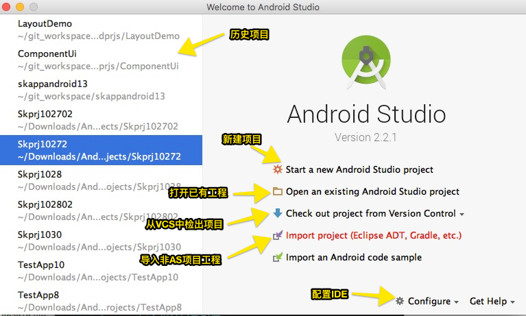

2.新建工程，已在安装Android Studio中介绍了。

3.打开已存在的工程。如下图：

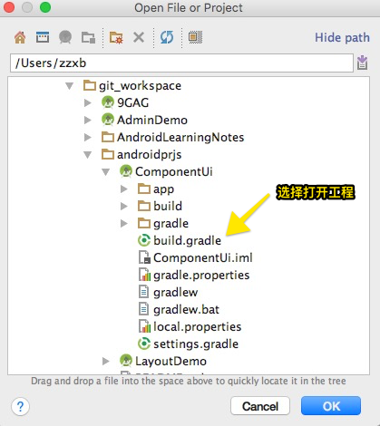

4.进入主界面，各Bar介绍


5.菜单栏，如下图：


6.工程项目透视图有多种，常用两种，如下图：

 

7.代码编辑区，如下图：

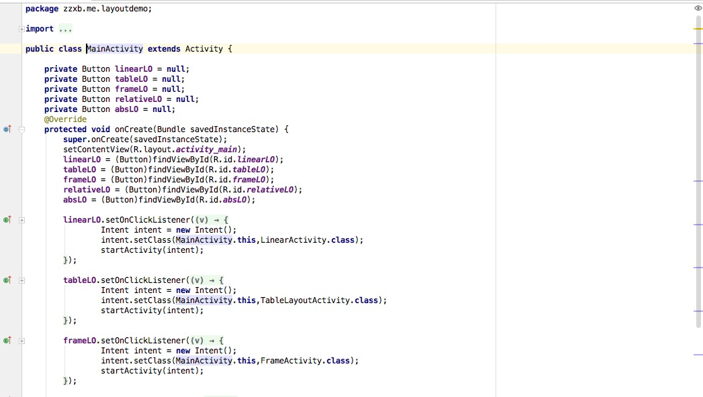

8.用于观察后台日志或监控程序执行过程以及性能的监控控制台，如下图：


9.对Gradle自动构建手动的操作，使用Gradle生命周期控制台，如下图:

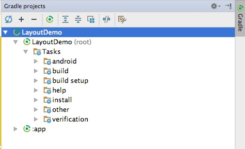

######  以上就是对于Android Studio IDE界面的介绍，下面我们来看看，基于Android Studio的目录结构。

首先，Android Studio中没有像Eclipse或MyEclipse中WorkSpace(工作空间)的概念，只有工程或项目的概念，在Android Studio中的工程包含多个Moudle(模块).每个模块都可以独立运行或被引用。Android Studio强烈建议一个工程或项目多Moudle(模块)的设计，这样更加的便于维护和开发。

那么，我们来看一下目录结构，以及它们的作用。

1.我们再来回顾一下Android工程透视图,如下图：


app模块是我们关注的重点

2.mainifests目录下mainifest.xml，如下图:


该文件是每个android程序中必须的文件。它位于整个项目的根目录，描述了package中暴露的组件（activities, services, 等等），他们各自的实现类，各种能被处理的数据和启动位置。 除了能声明程序中的Activities, ContentProviders, Services, 和Intent Receivers,还能指定permissions和instrumentation（安全控制和测试），同时用于控制Android应用的名称、图标、访问权限等整体属性。

3.java目录是源代码目录，如下图:


4.res目录是所有android模块下所有资源文件的集合，比如：layout布局xml配置文件，图片资源文件集合，资源信息或国际化配置信息文件。


那么，我们逐个看一下各个子目录作用以及文件。

###### drawable目录，将图片等资源放在drawable-hdip中，将一些和XML文件相关的内容（图片选择器、文字颜色选择器、自定义形状等）放在drawable中。

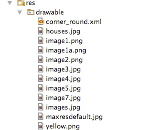

###### layout目录，放置所有界面的布局xml文件。


###### 具体布局样例，如图：


###### mipmap目录，用于存放原生图片（图ic_launcher.png），缩放上有性能优化; 


###### values目录，讲所有字符串资源文件，颜色等资源文件

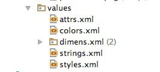

###### strings.xml 字符串资源文件


###### colors.xml 颜色资源文件

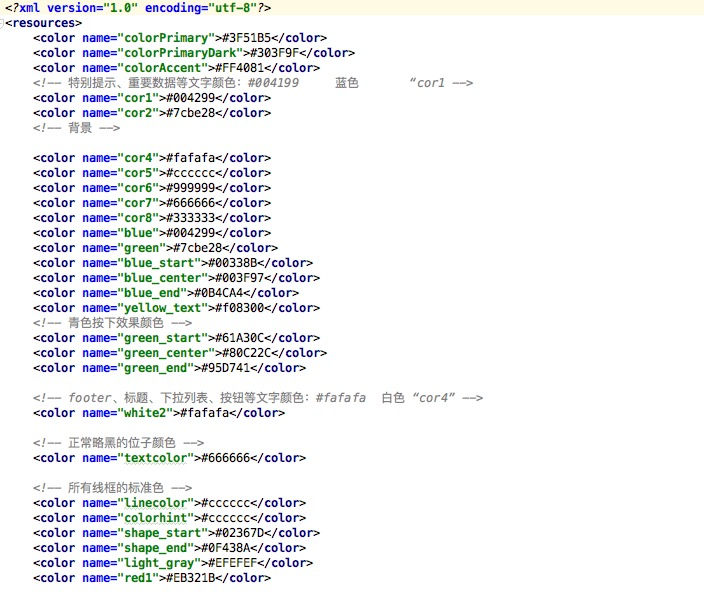

###### dimens.xml 颜色资源文件


5.Gradle Script目录，关于所有Gradle的配置文件。


###### build.gradle(project)

设置整个工程的gradle配置文件

###### build.gradle(Module)

设置工程中某个模块的gradle配置文件，这个文件是我们关注的重点，尤其是当我们引入第三方类库时，要在这个文件中配置。如下图：


###### gradle-wrapper.properties

配置gradle的基本信息，例如：安装目录等信息。一般，我们很少修改。

###### gradle.properties

配置gradle编译运行以及性能的配置文件

###### local.properties

配置android sdk目录位置

#### 关于android运行

对于android程序运行，目前有两种方式：虚拟机和真机运行

虚拟机，这种方式可以在android studio中配置，也可以直接使用第三方虚拟机，比如：[genymotion](https://www.genymotion.com/)和[海马玩](http://droid4x.haimawan.com/)等.介于genymotion访问速度非常慢的原因，大家也可以使用海马玩。第三方虚拟机的方式不需要配置安装直接运行，android studio会以真机运行方式执行安装和运行。

真机运行，这种方式用USB线连接电脑的方式直接安装运行。

##### 我建议使用这种方式，因为真机运行可以更准确的测试程序兼容性、性能等情况。

###### 推荐一个基于chrome的第三方插件-Vysor,这是一个可以将真机屏幕投射到电脑上的插件，可以用于演示项目。

#### 1. LayoutDemo之android布局

##### 有哪些布局类型？

Android系统中为我们提供的五大布局：LinearLayout(线性布局)、FrameLayout(单帧布局)、AbsoluteLayout(绝对布局)、TablelLayout(表格布局)、RelativeLayout(相对布局)。其中最常用的的是LinearLayout、TablelLayout和RelativeLayout。这些布局都可以嵌套使用。<br/>

##### LinearLayout(线性布局)

线性布局是按照水平或垂直的顺序将子元素(可以是控件或布局)依次按照顺序排列，每一个元素都位于前面一个元素之后。线性布局分为两种：水平方向和垂直方向的布局。分别通过属性android:orientation="vertical" 和 android:orientation="horizontal"来设置。<br/>

案例代码分析：

```xml
<LinearLayout xmlns:android="http://schemas.android.com/apk/res/android"
    xmlns:tools="http://schemas.android.com/tools"
    android:layout_width="match_parent"
    android:layout_height="match_parent"
    android:orientation="vertical"
    android:gravity="center_vertical|center_horizontal"
    tools:context="zzxb.me.layoutdemo.MainActivity">

    <Button
        android:id="@+id/linearLO"
        android:text="@string/linear_name"
        android:layout_weight="1"
        android:layout_width="wrap_content"
        android:layout_height="wrap_content" />

    <TextView
        android:layout_weight="4"
        android:layout_width="wrap_content"
        android:layout_height="wrap_content" />

    <Button
        android:id="@+id/tableLO"
        android:text="@string/table_name"
        android:layout_weight="1"
        android:layout_width="wrap_content"
        android:layout_height="wrap_content" />

    <TextView
        android:layout_weight="4"
        android:layout_width="wrap_content"
        android:layout_height="wrap_content" />


    <Button
        android:id="@+id/frameLO"
        android:text="@string/frame_name"
        android:layout_weight="1"
        android:layout_width="wrap_content"
        android:layout_height="wrap_content" />

    <TextView
        android:layout_weight="4"
        android:layout_width="wrap_content"
        android:layout_height="wrap_content" />


    <Button
        android:id="@+id/relativeLO"
        android:text="@string/relative_name"
        android:layout_weight="1"
        android:layout_width="wrap_content"
        android:layout_height="wrap_content" />

    <TextView
        android:layout_weight="4"
        android:layout_width="wrap_content"
        android:layout_height="wrap_content" />


    <Button
        android:id="@+id/absLO"
        android:text="@string/abslayout_name"
        android:layout_weight="1"
        android:layout_width="wrap_content"
        android:layout_height="wrap_content" />

</LinearLayout>
```

线性布局是用\<LinearLayout\>标签标示，其中常用的属性：<br/>
layout_width/layout_height:设置宽度和高度，其值有：wrap_content(适配内容大小)，match_parent(适配父容器大小),此两个属性在各个控件中为通用属性<br/>
id:唯一标识该控件值<br/>
orientation:设置该布局是水平布局(horizontal)还是纵向布局(vertical)<br/>
gravity:设置控件的对齐方式，常用值：center_vertical(纵向居中)|center_horizontal(水平居中)<br/>

在\<Button\>标签中，也同样有id,layout_width以及lay_height属性。同时，还有如下常用属性：<br>
text:设置按钮文字，这里有两种方式，一种是直接硬编码，即直接写内容，例如：<br>

```xml
   android:text="按钮"
```

第二种方式是非硬编码方式，是通过配置strings.xml文件来配置，例如：<br/>

```xml
<resources>
   <string name="btnText">按钮</string>
</resources>
```

然后，通过：<br/>

```xml
android:text="@string/btnText"
```

引用。<br/>

页面跳转的方式：<br/>

```java
                Intent intent = new Intent();
                intent.setClass(MainActivity.this,LinearActivity.class);
                startActivity(intent);
```

##### TableLayout(表格布局)

表格布局与常见的表格类似，以行、列的形式来管理放入其中的UI组件。表格布局使用\<TableLayout\>标签定义，在表格布局中，可以添加多个\<TableRow\>标签占用一行。由于\<TableRow\>标签也是容器，所以还可以在该标签中添加其他组件，每添加一个组件，表格就会增加一列。在表格布局中，列可以被隐藏，也可以被设置为伸展的，从而填充可利用的屏幕空间，还可以设置为强制收缩，直到表格匹配屏幕大小。<br/>

TableLayout跟TableRow 是一组搭配应用的布局，TableLayout置底，TableRow在TableLayout的上方，而Button、TextView等控件就在TableRow之上.TableLayout是一个应用错杂的布局，最简单的用法就仅仅是拖沓控件做出个界面，但实际上，会经常在代码里应用TableLayout，例如做出表格的结果。<br/>

重要的几个属性如下:<br/>

```xml
    android:collapseColumns="1,3" 隐藏第二列和第4列的控件
    android:stretchColumns="0,2,4" 第一列和三列以及第五列的空白textview被拉伸
    android:shrinkColumns="1,3"  第二列和第4列的控件被收缩
```

案例代码：

```xml
    <TableLayout
        android:stretchColumns="0,2,4"
        android:layout_width="match_parent"
        android:layout_height="match_parent">
        <EditText
            android:hint="请输入用户名"
            android:textSize="15sp"
            android:layout_margin="6dp"
            android:background="@drawable/corner_round"
            android:drawableLeft="@mipmap/account"
            android:layout_width="match_parent"
            android:layout_height="wrap_content" />

        <EditText
            android:hint="请输入密码"
            android:layout_margin="6dp"
            android:textSize="15sp"
            android:inputType="textPassword"
            android:background="@drawable/corner_round"
            android:drawableLeft="@mipmap/passwowrd"
            android:layout_width="match_parent"
            android:layout_height="wrap_content" />

        <TableRow>
            <TextView
                android:layout_width="wrap_content"
                android:layout_height="wrap_content" />

            <Button
                android:text="登录"
                android:layout_width="wrap_content"
                android:layout_height="wrap_content" />

            <TextView
                android:layout_width="wrap_content"
                android:layout_height="wrap_content" />

            <Button
                android:text="注册"
                android:layout_width="wrap_content"
                android:layout_height="wrap_content" />

            <TextView
                android:layout_width="wrap_content"
                android:layout_height="wrap_content" />

        </TableRow>
    </TableLayout>
```

##### FrameLayout(帧布局)

帧布局被设计成在一个屏幕区域显示一个单一的项(single item)。通常FrameLayout显示一个单一的子控件，它支持的布局属性不够丰富，一般通过layout_gravity来设置子控件的位置。<br/>
FrameLayout的子控件被绘制在一个堆栈中，最近添加进来的子控件在堆栈的顶部。<br/>

图例：<br/>


案例代码：<br/>

```xml
    <FrameLayout
        android:layout_width="match_parent"
        android:layout_height="match_parent">

        <ImageView
            android:layout_width="match_parent"
            android:layout_height="match_parent"
            android:src="@mipmap/movie"
            android:contentDescription="@string/movie_desc"
            />
        <ImageView
            android:layout_width="wrap_content"
            android:layout_height="wrap_content"
            android:src="@mipmap/button"
            android:contentDescription="@string/pause_desc"
            android:layout_gravity="center"
            />


    </FrameLayout>
```

##### RelativeLayout(相对布局)

相对布局，子控件的位置关系可以通过子控件与父控件、子控件与子控件来确定，子控件之间位置可以重叠,后面的控件会盖在前面控件之上，拓展性好，灵活方便，是使用最多的布局方式。<br/>

案例代码：<br/>

```xml
    <RelativeLayout
        android:layout_width="match_parent"
        android:layout_height="wrap_content">

        <EditText
            android:id="@+id/et_uname"
            android:hint="请输入用户名"
            android:textSize="20sp"
            android:background="@drawable/corner_round"
            android:layout_alignParentTop="true"
            android:layout_width="match_parent"
            android:layout_height="wrap_content" />

        <EditText
            android:id="@+id/et_pwd"
            android:hint="请输入密码"
            android:inputType="textPassword"
            android:layout_marginTop="12dp"
            android:background="@drawable/corner_round"
            android:textSize="20sp"
            android:layout_below="@+id/et_uname"
            android:layout_width="match_parent"
            android:layout_height="wrap_content" />

    </RelativeLayout>

    <RelativeLayout
        android:layout_width="match_parent"
        android:layout_height="wrap_content">

        <Button
            android:id="@+id/btn_login"
            android:text="登录"
            android:layout_width="150dp"
            android:layout_height="wrap_content" />

        <View
            android:id="@+id/v1"
            android:layout_toRightOf="@+id/btn_login"
            android:layout_width="50dp"
            android:layout_height="0dp" />

        <Button
            android:id="@+id/btn_reg"
            android:layout_toRightOf="@+id/v1"
            android:text="注册"
            android:layout_width="150dp"
            android:layout_height="wrap_content" />

    </RelativeLayout>
```

相对布局使用\<RelativeLayout\>标签，其常用属性如下：<br/>

android:layout_toLeftOf="@+id/name" 指定控件的左边<br/>
android:layout_toRightOf="@+id/name" 指定控件的右边<br/>
android:layout_above="@+id/name" 指定控件的上边<br/>
android:layout_below="@+id/name" 指定控件的下边<br/>
ndroid:layout_alignLeft="@+id/name" 与指定控件左对齐<br/>
android:layout_alignRight="@+id/name" 与指定控件右对齐<br/>
android:layout_alignTop="@+id/name" 与指定控件顶部对齐<br/>
android:layout_alignBottom="@+id/name" 与指定控件底部对齐<br/>
android:layout_alignParentLeft="true" 与父控件的左边对齐<br/>
android:layout_alignParentRight="true" 与父控件的右边对齐<br/>
android:layout_alignParentTop="true" 与父控件顶部对齐<br/>
android:layout_alignParentBottom="true" 与父控件底部对齐<br/>
android:layout_centerHorizontal="true" 在父控件中水平居中<br/>
android:layout_centerVertical="true" 在父控件中垂直居中<br/>
android_layout_centerInParent="true" 在父控件中中部居中<br/>

##### AbsoluteLayout(绝对布局)

绝对布局，子控件的位置以绝对的位置定位，子控件之间可以重叠，相对于其他布局，缺少灵活性，在最新的android版本中已经不建议使用。<br/>

##### 总结

在android布局控制中，最常用的是线性布局和相对布局，往往它们通常是配合使用，也就是嵌套使用。<br/>

##### 关于layout_gravity与gravity的区别

从名字上可以看到，android:gravity是对元素本身说的，元素本身的文本显示在什么地方靠着换个属性设置，不过不设置默认是在左侧的。<br/>

android:layout_gravity是相对与它的父元素说的，说明元素显示在父元素的什么位置。<br/>

比如说button： android:layout_gravity 表示按钮在界面上的位置。 android:gravity表示button上的字在button上的位置。<br/>

#### ComponentUI之核心控件

##### 文本框与编辑框

android中提供了两种文本组件：一种是文本框(TextView),用于在屏幕上显示文本；另外一种是编辑框(EditText),用于在屏幕上显示可编辑的文本框。EditText是TextView的子类，所以，很多EditView上的属性在TextView上也适用。

##### 文本框

\<TextView\>标签是文本控件，用于文字显示的控件，常用的属性也有id,text,textSize,layout_width以及lay_height属性等，同时，该控件也可以用作间隔控件与控件间距的作用。<br/>
layout_weight:设置该控件占父控件的权重。该属性也同样用于其他控件。<br/>
例如：<br/>

```xml
    <Button
        android:id="@+id/relativeLO"
        android:text="@string/relative_name"
        android:layout_weight="1"
        android:layout_width="wrap_content"
        android:layout_height="wrap_content" />

    <TextView
        android:layout_weight="4"
        android:layout_width="wrap_content"
        android:layout_height="wrap_content" />


    <Button
        android:id="@+id/absLO"
        android:text="@string/abslayout_name"
        android:layout_weight="1"
        android:layout_width="wrap_content"
        android:layout_height="wrap_content" />
```

特殊属性说明：<br/>

android:drawableLeft/Right:用于在文本框内文本的左侧(右侧)绘制制定图像。<br/>

##### 编辑框

\<EditText\>标签是编辑框，由于是TextView的子类，所以，很多TextView的属性也适用于编辑框。

常用属性：<br/>

android:hint:用于设置当编辑框中文本内容为空时，默认显示的提示文本<br/>
android:inputType:用于指定当前编辑框输入内容的文本类型，其中常用有textPassword,phone等等<br/>
android:singleLine:用于指定该编辑框是否为单行模式，其属性值为：true/false。<br/>

##### 按钮

android中提供了普通按钮和图片按钮两种按钮组件。

普通按钮\<Button\>标签和图片按钮\<ImageButton\>

图片按钮常用属性：<br/>

android:src:图片地址

##### 单选按钮

在android中，单选按钮和复选框都继承了普通按钮，因此，它们都可以直接使用普通按钮支持的属性和方法。与普通按钮不同的是，它们都提供了可选中的功能。

单选按钮在默认情况下，显示为一个圆形图标，并且在该图标旁边放置一些说明文字。它使用\<RadioButton\>标签。通常情况下，RadioButton控件需要与RadioGroup组件一起使用，组成一个单选按钮组。

例如:<br/>

```xml
        <RadioGroup
            android:orientation="horizontal"
            android:id="@+id/bg_sex"
            android:layout_width="wrap_content"
            android:layout_height="wrap_content">

            <RadioButton
                android:id="@+id/sexMan"
                android:text="男"
                android:checked="true"
                android:layout_width="wrap_content"
                android:layout_height="wrap_content" />

            <RadioButton
                android:id="@+id/sexWoman"
                android:text="女"
                android:layout_width="wrap_content"
                android:layout_height="wrap_content" />

            <RadioButton
                android:id="@+id/sexOther"
                android:text="保密"
                android:layout_width="wrap_content"
                android:layout_height="wrap_content" />

        </RadioGroup>
```

RadioButton常用属性：<br/>

android:checked:是否选中，其值为true/false.<br/>

使用单选按钮(RadioButton)有两种方式，第一种，直接在xml中布局单选按钮。这种方式常用于固定的单选值，例如：选中性别等功能。<br/>
另外一种，代码动态生成单选按钮。这种方式比较常用于单选值是动态获取的，而非固定。<br/>

第一种方式：相对简单，如上例展示。<br/>

第二种方式：使用代码生成。案例如下：<br/>

定义一个RadioGroup组。<br/>

```xml
    <LinearLayout
        android:gravity="center"
        android:orientation="horizontal"
        android:layout_width="wrap_content"
        android:layout_height="wrap_content">

        <TextView
            android:text="状态:"
            android:layout_width="wrap_content"
            android:layout_height="wrap_content" />

        <RadioGroup
            android:orientation="horizontal"
            android:id="@+id/rg_state"
            android:layout_width="wrap_content"
            android:layout_height="wrap_content">

        </RadioGroup>

    </LinearLayout>
```

在Activity中，代码生成RadioButton,并添加到RadioGroup中。

```java
    private RadioGroup radioGroup = null;
    private String[] rbState = {"离职","在职","其他"};

    @Override
    protected void onCreate(Bundle savedInstanceState) {
        super.onCreate(savedInstanceState);
        setContentView(R.layout.activity_radio);
        radioGroup = (RadioGroup)findViewById(R.id.rg_state);
        for(int i = 0;i < rbState.length;i++){
            RadioButton rb = new RadioButton(this);
            rb.setText(rbState[i]);
            radioGroup.addView(rb);
            //设置第一个单选按钮为默认选中 
            if(i == 0){
                radioGroup.check(rb.getId());
            }
        }

    }
```

##### 复选框(CheckBox)

在默认情况下，复选框显示为一个方块图标，并且在该图标旁边放置一些说明性文字。与单选框按钮唯一不同的是，复选框可以进行多选设置，每一个复选框都提供“选中”和“不选中”两种状态。CheckBox类同样是Button的子类，所以，可以直接使用Button支持的各种属性。

与单选按钮类似，复选框也有两种方式添加到屏幕中，一种是通过在XML布局文件中使用\<CheckBox\>标签添加。

例如：

```xml
    <LinearLayout
        android:orientation="horizontal"
        android:layout_width="wrap_content"
        android:layout_height="wrap_content">

        <TextView
            android:text="@string/checkViewName"
            android:textSize="16sp"
            android:layout_width="wrap_content"
            android:layout_height="wrap_content" />
        <LinearLayout
            android:id="@+id/sportsChecksGroup"
            android:orientation="horizontal"
            android:layout_width="wrap_content"
            android:layout_height="wrap_content">

        <CheckBox
            android:text="@string/footBallName"
            android:textSize="16sp"
            android:layout_width="wrap_content"
            android:layout_height="wrap_content" />

        <CheckBox
            android:text="@string/basketBallName"
            android:textSize="16sp"
            android:layout_width="wrap_content"
            android:layout_height="wrap_content" />

        <CheckBox
            android:text="@string/ppBallName"
            android:textSize="16sp"
            android:layout_width="wrap_content"
            android:layout_height="wrap_content" />
        </LinearLayout>
    </LinearLayout>
```

与单选按钮不同的是，复选按钮没有类似单选按钮中的\<RadioGruop\>标签，如果要想实现复选框类似的分组，需要使用\<LinearLayout\>等布局标签。即一个布局标签内的所有复选框控件为一组。

另一种方式，是在JAVA文件中，通过代码实现动态的加载复选框，如下：<br/>

```xml
    <LinearLayout
        android:orientation="horizontal"
        android:layout_width="wrap_content"
        android:layout_height="wrap_content">

        <TextView
            android:text="@string/check2Name"
            android:textSize="16sp"
            android:layout_width="wrap_content"
            android:layout_height="wrap_content" />

        <LinearLayout
            android:id="@+id/mingXingChecksGruop"
            android:orientation="horizontal"
            android:layout_width="wrap_content"
            android:layout_height="wrap_content" />


    </LinearLayout>
```

则java代码为：<br/>

```java
private String[] mingXings = {"陈奕迅","张学友","王菲"};
private LinearLayout mingXingChecksGroup = null;
    @Override
    protected void onCreate(Bundle savedInstanceState) {
        super.onCreate(savedInstanceState);
        setContentView(R.layout.activity_checks);
        mingXingChecksGroup = (LinearLayout) findViewById(R.id.mingXingChecksGruop);
        for(String mingXing : mingXings){
            CheckBox cb = new CheckBox(this);
            cb.setText(mingXing);
            cb.setTextSize(16);
            mingXingChecksGroup.addView(cb);
        }
    }
```

复选框的动态加载方式，与单选按钮类似。

当点击按钮获得复选框值，也与单选按钮类似，代码如下：

```java
        btnChecksSubmit.setOnClickListener(new View.OnClickListener() {
            @Override
            public void onClick(View view) {
                for(int i = 0;i < mingXingChecksGroup.getChildCount();i++){
                    CheckBox cb = (CheckBox)mingXingChecksGroup.getChildAt(i);
                    if(cb.isChecked()){
                        Log.i("mingxing",cb.getText().toString());
                    }
                }
        });
```

##### 选择按钮:ToggleButton和Switch

ToggleButton和Switch按钮非常相近，只是在表现样式上有区别，如下图：

ToggleButton:<br/>
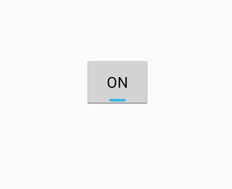

Switch:<br/>
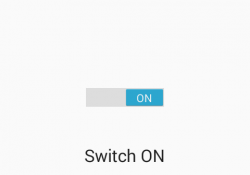

这两个控件只有在表现形式上有些区别，其他的包括属性，使用方式上基本一致。它们通用常用属性，如下：

```xml
            android:textOff="关闭WIFI"
            android:textOn="打开WIFI"
```

常用的监听方法：

```java
        tbnWifi.setOnCheckedChangeListener(new CompoundButton.OnCheckedChangeListener() {
            @Override
            public void onCheckedChanged(CompoundButton compoundButton, boolean b) {
                if(b){
                    Log.i("wifi",tbnWifi.getTextOn().toString());
;                }else{
                    Log.i("wifi",tbnWifi.getTextOff().toString());
                }
            }
        });
```

获取按钮提交后的值，如下：<br/>

```java
tbnWifi = (ToggleButton)findViewById(R.id.tbn_wifi);
Log.i("tbnwifistate",""+tbnWifi.isChecked());
```

##### SeekBar(拖动条)和RatingBar(星级评分条)

在Android中，提供了两种允许用户通过拖动来改变进度的控件，分别是SeekBar(拖动条)和RatingBar(星级评分条)。

如图:<br/>

拖动条：<br/>
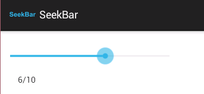

星级评分条:<br/>
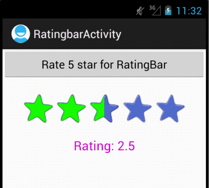

拖动条允许用户拖动滑块来改变值，通常用于实现对某种数值的调节。比如：调节图片大小、透明度或音量等。

在XML布局文件中使用\<SeekBar\>标签。

```xml
    <SeekBar
        android:layout_marginTop="30dp"
        android:id="@+id/seekbar1"
        android:layout_width="match_parent"
        android:layout_height="wrap_content"
        android:max="100"
        android:progress="30" />
```

常用属性：

```xml
android:max : 最大值
android:progress : 当前值
```

在JAVA文件中常用监听：<br/>

```java
private SeekBar.OnSeekBarChangeListener seekBarChange = new SeekBar.OnSeekBarChangeListener() {

        //当滑动停止时调用该方法
        @Override
        public void onStopTrackingTouch(SeekBar seekBar) {
        }

        //当开始滑动时调用该方法
        @Override
        public void onStartTrackingTouch(SeekBar seekBar) {
        }

        //当滑动值发生变化时调用该方法
        @Override
        public void onProgressChanged(SeekBar seekBar, int progress,
                                      boolean fromUser) {
        }
    };
```

星级评分条与拖动条类似，都允许用户拖动来改变进度，所不同的是，星级评分条通过星星图案表示进度。

在XML布局文件中使用\<RatingBar\>标示星级评分条。

```xml
    <RatingBar
        android:id="@+id/rbRating1"
        android:layout_width="wrap_content"
        android:layout_height="wrap_content"
        android:isIndicator="false"
        android:max="100"
        android:numStars="4"
        android:rating="2.5"
        android:stepSize="0.5" />
```

常用属性：

```xml
        android:isIndicator : 是否允许用户改变星级，true为不允许改变
        android:max         : 最大值
        android:numStars    : 共有多少个星
        android:rating      : 默认的星级
        android:stepSize    : 步进值
```

常用监听方法：

```java
    public void onRatingChanged(RatingBar ratingBar, float rating,
                                boolean fromUser) {
    }
```

提交获得值常用方法：

```java
   getRating():获得等级,表示选中了几颗星。
   getProgress():获得进度值.
```

##### ImageView(图像视图)

图像视图用于在屏幕中显示任何Drawable对象，通常用来显示图片。在XML布局文件中，使用\<ImageView\>标签。

常用属性：

```xml
  android:adjustViewBounds : 用于设置ImageView是否调整自己的边界来保持所显示图片的长宽比
  android:maxHeight        : 最大高度
  android:maxWidth         : 最大宽度
  android:scaleType        : 用于设置所显示图片如何缩放或移动以适应ImageView的大小
  android:src              : 地址id
```

##### AutoCompleteTextView(自动完成文本框)

自动完成文本框(AutoComleteTextView),用于实现允许用户输入一定字符后，显示一个下拉菜单，供用户从中选择，当用户选择某个选项后，按用户选择自动填写该文本框。AutoCompleteTextView控件继承于EditText,所以它支持所有EditText组件提供的属性。<br/>

在XML布局文件中，使用\<AutoCompleteTextView\>标签创建，常用属性：

```xml
   android:completionHint          : 为弹出的下拉菜单指定提示标题
   android:completionThreshold     : 指定用户至少输入几个字符才会显示提示
```

在JAVA代码中具体实现：<br/>

1.获得控件对象<br/>
```java
autotext=(AutoCompleteTextView)findViewById(R.id.autotext);
```

2.设置数据源<br/>
```java
String[] autoStrings=new String[]{"New York","Tokyo","beijing","london","Seoul Special","Los Angeles"};
```

3.创建ArrayAdapter适配器,设置ArrayAdapter，并且设定以单行下拉列表风格展示（第二个参数设定）。<br/>
```java
ArrayAdapter<String> adapter=new ArrayAdapter<String>(AutoTextActivity.this,
                android.R.layout.simple_dropdown_item_1line, autoStrings);
```

4.将适配器装配到组件中<br/>
```java
autotext.setAdapter(adapter);
```

同时，在android中还有一种是多选选项(\<MultiAutoCompleteTextView\>)与\<AutoCompleteTextView\>基本一致。

##### Spinner(列表选择框)

列表选择框(Spinner)相当于在网页中常见的下拉列表框，通常用于提供一系列可选择的列表项供用户进行选择。

在XML布局文件中使用\<S	pinner\>标签添加，如下：

```xml
    <Spinner
        android:id="@+id/spinnerBase1"
        android:layout_width="match_parent"
        android:layout_height="wrap_content"
        android:entries = "@array/beijing"
        android:spinnerMode="dropdown" />
```

常用属性：<br/>

```xml
	android:spinnerMode : 下拉框显示样式，dropdown默认下拉式，dialog弹出对话框模式
	android:entries     : 绑定静态数据源
```

在列表选择框中，数据源有两种：第一种配置静态数据源。第二种在java代码中配置动态数据源。

静态数据源配置方式：<br/>

1.在strings.xml中配置\<string-array\>标签<br/>

```xml
    <string-array name="beijing">
        <item>朝阳区</item>
        <item>海淀区</item>
        <item>房山区</item>
        <item>丰台区</item>
        <item>东城区</item>
        <item>西城区</item>
    </string-array>
```

2.\<Spinner\>的属性中绑定<br/>

```xml
	android:entries = "@array/beijing"
```

Java代码中动态绑定数据源方式:<br/>

1.获得控件对象<br/>
```java
spinner1 = (Spinner) findViewById(R.id.spinnerBase);
```

2.设置数据源<br/>
```java
String[] autoStrings=new String[]{"New York","Tokyo","beijing","london","Seoul Special","Los Angeles"};
```

3.创建ArrayAdapter适配器,设置ArrayAdapter，并且设定以单行下拉列表风格展示（第二个参数设定）。<br/>
```java
        ArrayAdapter<String> adapter = new ArrayAdapter<String>(
                SpinnerActivity.this, android.R.layout.simple_spinner_item,autoStrings);
```

4.将适配器装配到组件中<br/>
```java
spinner1.setAdapter(adapter);
```

##### ProgressBar(进度条)

当一个应用在后台执行时，前台界面不会有任何信息。这时用户根本不知道程序是否在执行以及执行进度等，因此需要使用进度条来提示程序执行的进度。在A	ndroid中，进度条(ProgressBar)用于用户显示某个耗时操作完成的百分比。<br/>

在XML布局文件中通过\<ProgressBar\>标签。<br/>

```xml
    <ProgressBar
        android:id="@+id/pbHor"
        style="@android:style/Widget.ProgressBar.Horizontal"
        android:layout_width="match_parent"
        android:layout_height="wrap_content"
        android:max="100"
        android:progress="20"
        android:secondaryProgress="60" />
```

常用属性：<br/>

```xml
	style : 可以为进度指定风格。@android:style/Widget.ProgressBar.Horizontal(粗水平长条进度条)、@android:style/Widget.ProgressBar.Small(小跳跃、旋转画面进度条)、@android:style/Widget.ProgressBar.Large(大跳跃、旋转画面进度条)
	android:max : 最大值
	android:progress : 当前进度值
	android:secondaryProgress : 第二块进度条值
```

##### TabHost(选项卡)

TabHost可以方便地在窗口上放置多个标签页，每个标签页相当于获得了一个与外部容器大小相同的组件摆放区域.<br/>

如下图:<br/>

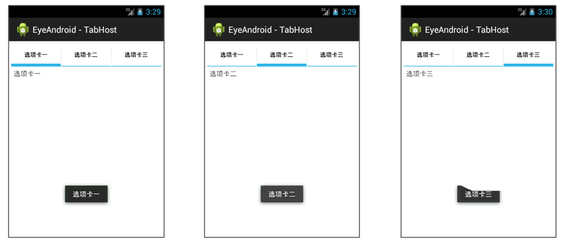

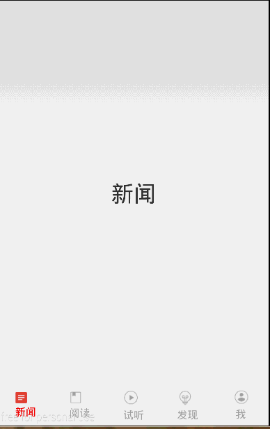

在XML布局文件中，选项卡常用的标签有\<TabHost\>和\<TabWidget\>两个标签，通常这两个标签需要配合使用。

代码如下：<br/>

```xml
    <TabHost
        android:id="@+id/tabHost"
        android:layout_alignParentLeft="true"
        android:layout_alignParentBottom="true"
        android:layout_width="match_parent"
        android:layout_height="match_parent">

        <LinearLayout
            android:orientation="vertical"
            android:layout_width="match_parent"
            android:layout_height="match_parent">

            <FrameLayout
                android:id="@android:id/tabcontent"
                android:layout_weight="1"
                android:layout_width="match_parent"
                android:layout_height="match_parent">

                <LinearLayout
                    android:id="@+id/tab1"
                    android:orientation="vertical"
                    android:layout_width="match_parent"
                    android:layout_height="match_parent">

                </LinearLayout>

                <LinearLayout
                    android:id="@+id/tab2"
                    android:orientation="vertical"
                    android:layout_width="match_parent"
                    android:layout_height="match_parent">


                </LinearLayout>


                <LinearLayout
                    android:id="@+id/tab3"
                    android:orientation="vertical"
                    android:layout_width="wrap_content"
                    android:layout_height="match_parent">

                </LinearLayout>

            </FrameLayout>

            <TabWidget
                android:id="@android:id/tabs"
                android:layout_width="match_parent"
                android:layout_height="wrap_content"></TabWidget>


        </LinearLayout>
    </TabHost>
```

布局文件说明：<br/>
1.将TabHost标签作为最外层包裹元素。<br/>
2.在其里面创建一个LinearLayout纵向线性布局<br/>
3.在线性布局下创建两个子元素，一个是FrameLayout帧式布局，在此布局下创建多个子页面布局(LinearLayout)，相当于多个Tab子页面。二个是创建TabWidget,相当于切换按钮。<br/>

##### 注意：<br/>

1.TabHost标签自带id值必须是：<br/>

```xml
android:id="@+id/tabHost"
``` 

2.TabWidget标签自带id值必须是:<br/>

```xml
android:id="@android:id/tabs"
```

3.如果想将选项按钮放置在最下方，必须设置如下：<br/>

```xml
    <TabHost
        android:id="@+id/tabHost"
        android:layout_alignParentLeft="true"
        android:layout_alignParentBottom="true" />
```

将TabWeight放置在FrameLayout之后。

在JAVA文件中装配步骤：<br/>

1.Activity继承ActivityGroup类。<br/>

```java
public class TabHostActivity extends ActivityGroup
```

2.获得TabHost对象实例.<br/>

```java
tabHost = (TabHost)findViewById(R.id.tabHost);
```

3.设置装配管理对象。<br/>

```java
tabHost.setup(this.getLocalActivityManager());
```

4.装配每一个Tab。<br/>

```java
TabHost.TabSpec ts = tabHost.newTabSpec("tab1").setIndicator("首页").setContent(new Intent(this,MainActivity.class));
tabHost.addTab(ts);
```

"tab1"是选项卡的唯一标识，只需唯一即可，与XML中的tab1无关。<br/>

##### Toast(消息提示框)与AlertDialog(对话框)

在项目开发中，经常需要将一些临时信息显示给用户，虽然使用一些基本组件也能达到显示信息的目的，但是这样做不仅会增加代码量，而且对于用户来说也不够友好。为此，Android提供了消息提示框和对话框显示这些信息。同时，它们没有对应的XML布局，都是通过JAVA代码来实现的。<br/>

消息提示框：<br/>

```java
Toast.makeText(AlertActivity.this,"这是提示框", Toast.LENGTH_SHORT).show();
```

对话框：<br/>

```java
AlertDialog.Builder ab = new AlertDialog.Builder(AlertActivity.this);
ab.setTitle("对话框");
ab.setMessage("这是一个普通对话框!");
ab.setPositiveButton("确定", new DialogInterface.OnClickListener() {
	@Override
 	public void onClick(DialogInterface dialog, int which) {
     //处理业务的
     Toast.makeText(AlertActivity.this, "你点击了确定",Toast.LENGTH_SHORT).show();
  }
});
ab.setNeutralButton("取消", new DialogInterface.OnClickListener() {
   @Override
   public void onClick(DialogInterface dialog, int which) {
     Toast.makeText(AlertActivity.this,"你点击的which值:"+which,Toast.LENGTH_SHORT).show();
   }
});
ab.create().show();
```

#### LuncherDmeo之引导页面案例

在Android项目中，经常出现加载应用前显示全屏图片的页面，在几秒之后，立刻跳转到项目首页的情况，我们管这种页面叫做项目引导页。<br/>

项目引导页制作步骤如下：<br/>

1.创建将引导页图片导入到资源目录中(drawable目录或mimap目录)<br/>
2.创建引导页Activity类以及layout布局文件(XML)<br/>
3.设置引导页XML布局文件的背景图。<br/>

```xml
android:background="@drawable/start"
```

4.设置AndroidManifest.xml配置文件，将初始页改为引导页Activity.<br/>

```xml
        <activity android:name=".WelcomeActivity"
            android:theme="@android:style/Theme.NoTitleBar.Fullscreen">
            <intent-filter>
                <action android:name="android.intent.action.MAIN" />

                <category android:name="android.intent.category.LAUNCHER" />
            </intent-filter>
        </activity>
```

将引导页设为全屏显示：<br/>

```xml
android:theme="@android:style/Theme.NoTitleBar.Fullscreen"
```

5.编写引导页Activity类。<br/>

5.1 创建Hander类

```java
    Handler handler = new Handler() {
        @Override
        public void handleMessage(Message msg) {
            //引导页跳转到下一页
            Intent i = new Intent(WelcomeActivity.this, MainActivity.class);
            startActivity(i);
            finish();
            super.handleMessage(msg);
        }
    };
```

5.2 在onCreate()方法中，编写定时跳转.<br/>

```java
        new Thread(new Runnable() {
            @Override
            public void run() {
                try {
                    Thread.sleep(5000);
                    handler.sendEmptyMessage(0);
                } catch (Exception e) {
                    e.printStackTrace();
                }

            }
        }).start();
```

完整代码如下：

```java
public class WelcomeActivity extends Activity {
    Handler handler = new Handler() {
        @Override
        public void handleMessage(Message msg) {
            Intent i = new Intent(WelcomeActivity.this, MainActivity.class);
            startActivity(i);
            finish();
            super.handleMessage(msg);
        }
    };

    @Override
    protected void onCreate(Bundle savedInstanceState) {
        super.onCreate(savedInstanceState);
        setContentView(R.layout.activity_welcome);

        new Thread(new Runnable() {
            @Override
            public void run() {
                try {
                    Thread.sleep(5000);
                    handler.sendEmptyMessage(0);
                } catch (Exception e) {
                    e.printStackTrace();
                }

            }
        }).start();
    }
}
```

配置应用logo以及应用名字的方式：<br/>

在AndroidManifest.xml文件中。<br/>

```xml
    <application
        android:allowBackup="true"
        android:icon="@drawable/logo"
        android:label="@string/app_name"
        android:supportsRtl="true"
        android:theme="@style/AppTheme">
```

其中icon属性为应用logo地址，label属性为app名字.<br/>

#### FragmentDemo之Fragment(片段)

##### 什么是片段

Fragment 表示 Activity 中的行为或用户界面部分。您可以将多个片段组合在一个 Activity 中来构建多窗格 UI，以及在多个 Activity 中重复使用某个片段。您可以将片段视为 Activity 的模块化组成部分，它具有自己的生命周期，能接收自己的输入事件，并且您可以在 Activity 运行时添加或移除片段（有点像您可以在不同 Activity 中重复使用的“子 Activity”）

##### 创建片段

要想创建片段，您必须创建 Fragment 的子类（或已有其子类）。Fragment 类的代码与 Activity 非常相似。它包含与 Activity 类似的回调方法，如 onCreate()、onStart()、onPause() 和 onStop()。实际上，如果您要将现有 Android 应用转换为使用片段，可能只需将代码从 Activity 的回调方法移入片段相应的回调方法中。

通常，您至少应实现以下生命周期方法：<br/>

onCreateView()<br/>
系统会在片段首次绘制其用户界面时调用此方法。 要想为您的片段绘制 UI，您从此方法中返回的 View 必须是片段布局的根视图。如果片段未提供 UI，您可以返回 null。

##### 生命周期
图例：<br/>


##### 具体实现

1.创建Fragment.

如下图：

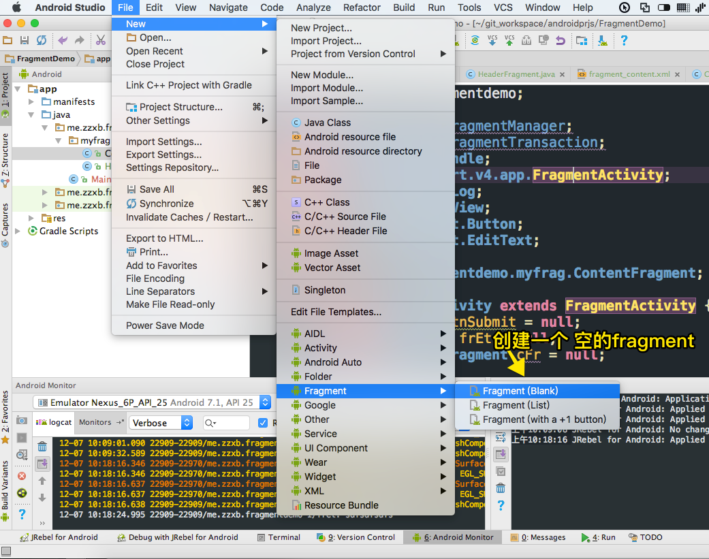

当创建完成后，会生成两个文件,.java文件和.xml文件,顾名思义，一个继承Fragment类文件，一个是该fragment的布局文件.

例如：<br/>

```java
public class HeaderFragment extends Fragment {


    public HeaderFragment() {
        // Required empty public constructor
    }
    @Override
    public View onCreateView(LayoutInflater inflater, ViewGroup container,
                             Bundle savedInstanceState) {
        // Inflate the layout for this fragment
        return inflater.inflate(R.layout.fragment_header, container, false);
    }

}
```

onCreateView() 的 container 参数是您的片段布局将插入到的父 ViewGroup（来自 Activity 的布局）。savedInstanceState 参数是在恢复片段时，提供上一片段实例相关数据的 Bundle。

inflate() 方法带有三个参数：

您想要扩展的布局的资源 ID；
将作为扩展布局父项的 ViewGroup。传递 container 对系统向扩展布局的根视图（由其所属的父视图指定）应用布局参数具有重要意义；
指示是否应该在扩展期间将扩展布局附加至 ViewGroup（第二个参数）的布尔值。（在本例中，其值为 false，因为系统已经将扩展布局插入 container — 传递 true 值会在最终布局中创建一个多余的视图组。）

```xml
<LinearLayout xmlns:android="http://schemas.android.com/apk/res/android"
    xmlns:tools="http://schemas.android.com/tools"
    android:layout_width="match_parent"
    android:layout_height="match_parent"
    tools:context="me.zzxb.fragmentdemo.myfrag.HeaderFragment">

    <!-- TODO: Update blank fragment layout -->
    <TextView
        android:text="这是头fragment"
        android:textSize="20sp"
        android:layout_width="wrap_content"
        android:layout_height="wrap_content" />


</LinearLayout>
```

fragment的布局文件，就是一个标准的布局文件，与Activity的布局文件格式基本一致。所以，我们认为fragment与Activity是一种宿主关系。

2.添加片段到Activity中

已经了解了如何创建提供布局的片段。接下来，需要将该片段添加到Activity 中。这一步骤有两种方式。<br/>

#### 注意宿主Activity一定要继承android.support.v4.app.FragmentActivity类，而非标准的Activity类.

##### 与Activity通信

Activity 也可以使用 findFragmentById() 或 findFragmentByTag()，通过从 FragmentManager 获取对 Fragment 的引用来调用片段中的方法。例如：

```java
ExampleFragment fragment = (ExampleFragment) getFragmentManager().findFragmentById(R.id.example_fragment);

```

第一种：在 Activity 的布局文件内声明片段<br/>

```xml
<?xml version="1.0" encoding="utf-8"?>
<LinearLayout xmlns:android="http://schemas.android.com/apk/res/android"
    xmlns:tools="http://schemas.android.com/tools"
    android:id="@+id/activity_main"
    android:layout_width="match_parent"
    android:layout_height="match_parent"
    android:orientation="vertical"
    tools:context="me.zzxb.fragmentdemo.MainActivity">

    <fragment
        android:id="@+id/fr_header"
        android:name="me.zzxb.fragmentdemo.myfrag.HeaderFragment"
        android:layout_width="match_parent"
        android:layout_height="wrap_content" />

    <fragment
        android:id="@+id/fr_content"
        android:name="me.zzxb.fragmentdemo.myfrag.ContentFragment"
        android:layout_width="match_parent"
        android:layout_height="wrap_content"/>

    <Button
        android:id="@+id/btn_submit"
        android:text="提交"
        android:layout_width="wrap_content"
        android:layout_height="wrap_content" />
</LinearLayout>
```

<fragment> 中的 android:name 属性指定要在布局中实例化的 Fragment 类。
当系统创建此 Activity 布局时，会实例化在布局中指定的每个片段，并为每个片段调用 onCreateView() 方法，以检索每个片段的布局。系统会直接插入片段返回的 View 来替代 <fragment> 元素。
注：每个片段都需要一个唯一的标识符，重启 Activity 时，系统可以使用该标识符来恢复片段（您也可以使用该标识符来捕获片段以执行某些事务，如将其移除）。 可以通过三种方式为片段提供 ID：
为 android:id 属性提供唯一 ID。
为 android:tag 属性提供唯一字符串。
如果您未给以上两个属性提供值，系统会使用容器视图的 ID。

第二种方式：通过编程方式将片段添加到某个现有 ViewGroup

```java
        FragmentManager fragmentManager = getFragmentManager();
        FragmentTransaction fragmentTransaction = fragmentManager.beginTransaction();
        ContentFragment contentFragment = new ContentFragment();
        fragmentTransaction.add(R.id.activity_main,contentFragment);
        fragmentTransaction.addToBackStack(null);
        fragmentTransaction.commit();
```

你可以在 Activity 运行期间随时将片段添加到 Activity 布局中。您只需指定要将片段放入哪个 ViewGroup。
要想在您的 Activity 中执行片段事务（如添加、移除或替换片段），您必须使用 FragmentTransaction 中的 API。您可以像下面这样从 Activity 获取一个 FragmentTransaction 实例：

```java
FragmentManager fragmentManager = getFragmentManager();
FragmentTransaction fragmentTransaction = fragmentManager.beginTransaction();
```

然后，您可以使用 add() 方法添加一个片段，指定要添加的片段以及将其插入哪个视图。例如：

```java
        ContentFragment contentFragment = new ContentFragment();
        fragmentTransaction.add(R.id.activity_main,contentFragment);
        fragmentTransaction.addToBackStack(null);
        fragmentTransaction.commit();
```

传递到 add() 的第一个参数是 ViewGroup，即应该放置片段的位置，由资源 ID 指定，第二个参数是要添加的片段。
一旦您通过 FragmentTransaction 做出了更改，就必须调用 commit() 以使更改生效。

#### 注意：如果使用代码方式添加片段，一定要继承import android.app.Fragment类，而非android.support.v4.app.Fragment类

#### 列表视图

#### 网格视图

#### 画廊视图

#### 基本程序单元Activity

#### Android应用核心Intent

#### Android事件处理

##### 键盘事件

##### 触摸事件

#### 资源访问

##### 字符串资源(strings.xml)

##### Android程序国际化

#### 多媒体应用开发之相机

#### ContentProvider数据共享

#### 消息处理之Handler

#### Service应用

#### 网络编程之Volley

#### 打包发布


## 修改日志
- 2016-10-13:
- [x] 创建演示项目,并对一些配置文件进行了注解。
- 2016-8-30:
- [x] 规划了整个教程的目录以及先后顺序。

## 参考资源
以下是在编写案例中收集的资源,对深入理解与运用有帮助

- [Gradle基础](http://stormzhang.com/devtools/2014/12/18/android-studio-tutorial4/)
- [官方API指南 中文版](https://developer.android.com/guide/index.html)


------
建议使用Android Studio开发工具。
